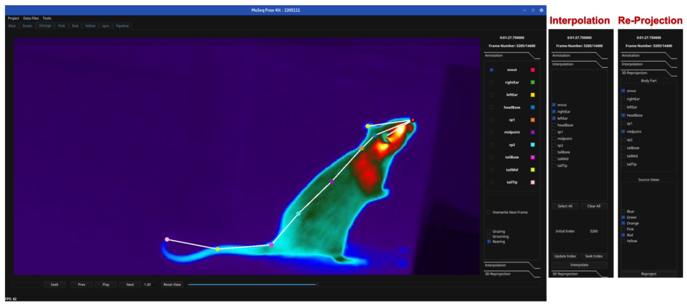
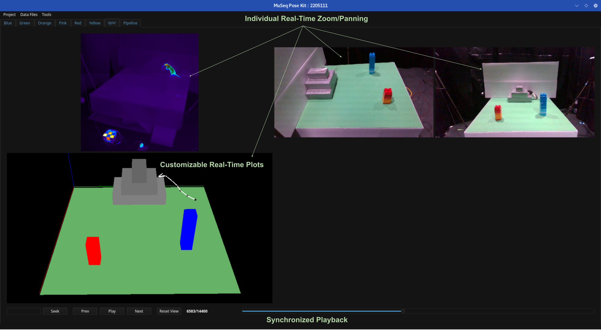
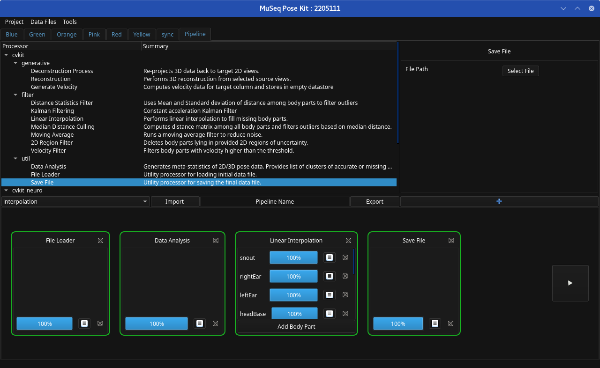
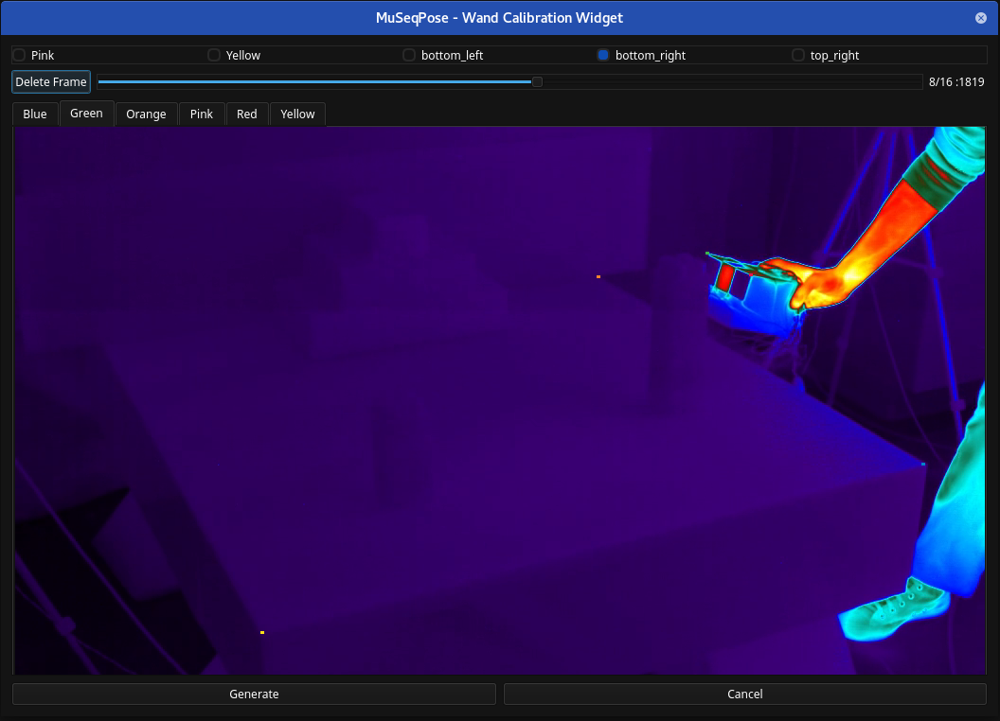

<h1><span style="color: #2D2926"><span style="color:#cc0000;">Mu</span>ltiview <span style="color:#cc0000;">Seq</span>uential <span style="color:#cc0000;">Pose</span> Kit</span></h1>

It is a user interface for the pose estimation and tracking packages of our framework [BU-CVKit](https://mahir1010.github.io/BU-CVKit/).
It automatically scans for installed plugins and programmatically generates an interface based on the metadata provided.
In addition, it supports standard pose estimation features such as pose and behavioral annotations, 3D reconstruction, reprojection, dynamic real-time plots, synchronized playback, and camera calibration.

<p><span style="color: #158219;font-weight: bold">Note: Video Tutorials will be added soon!</span></p>

## Installation
```shell
$ conda create -n cvkit python=3.10 pyside2=5.15.8 cudatoolkit
$ conda activate cvkit

#Follow from Step 2: Tensorflow website https://www.tensorflow.org/install/pip#linux (linux configuration)
#Ignore version numbers

$ pip install museqpose
```
## Launch
```shell
$ conda activate cvkit

$ MuSeqPose
```

## List of Primary Widgets
1. [Annotation Widget](#annotation-widget)
2. [Synchronized Playback Widget](#synchronized-playback-widget)
3. [Pipeline Widget](#pipeline-widget)
4. [Camera Calibration Widget](#camera-calibration-widget)

## Annotation Widget
The software generates an annotation widget for all annotation files defined in the configuration file. It consists of three sub-widgets: Pose and Behaviour annotation, Frame Interpolation, and Pose Reprojection.

<p align="center"></p>

### Pose and Behaviour Sub-Widget
- The user can play the videos with a dynamically generated skeleton. 
- The viewer supports keyboard+mouse shortcuts.
  - `ctrl+scroll` to zoom in and out; `ctrl+drag` to pan.
  -  `left-click` on any marker to select; `scroll` to switch focus through all markers.
  -  `lef-click+drag` to move the selected marker.
  -  `middle-mouse` to delete/un-delete selected marker. Invalid markers disappear, and the corresponding checkbox gets unchecked.
- Generates checkboxes for behaviors dynamically based on the configuration file.
  - Checking a behavior sets data at the corresponding frame number in the underlying datastore.
  - Selecting `Overwrite Next Frame` sets the selected behaviors to the next frame. This is useful to mark longer sequences of behaviors.
### Frame Interpolation Sub-Widget

- Used for quickly annotating a sequence of frames by annotating sentinel frames and interpolating the data for the frames in between.
- Users can select specific body parts for interpolation.
- `Update Index` button is used to mark the first frame by updating the `Initial Index`.
- `Interpolate` button interpolates selected parts for the frames between `Initial Index` and `Current Frame`.

### Pose Reprojection Sub-Widget

- Used to quickly annotate multiple views at the same time. The user can use this toolbox if the project is configured for multi-view camera setup and the calibration data is present.
- The user can select the target markers to reproject as well as source views. The reprojection method requires at least two views where all selected markers are annotated.


## Synchronized Playback Widget

The Synchronized Playback Widget generates multiple frame-synced streams of data as configured in the project file. It can include annotation videos and
real-time reconstruction or line plots.

<p align="center"></p>

- Each stream individually supports zooming and panning using the shortcuts defined in [Pose and Behaviour Sub-Widget](#pose-and-behaviour-sub-widget).
- Users can configure scene reconstruction plots to mimic their recording environment to a degree using high-performance [VisPy](https://github.com/vispy/vispy) plots. These plots can be configured by declaring pre-defined shapes in the project configuration.

## Pipeline Widget

This widget provides an interface to the Processor modules of the BU-CVKit framework. 
- Based on the metadata provided by the plugin developers, a form is dynamically generated for all available processors.
- Users can create a pipeline that performs a semantically meaningful computation, such as interpolating missing data for input datastore, as shown in the figure.
- This pipeline can be exported and shared with the community. Although this is a simple example, users can create complex pipelines.
- The pipeline interface dynamically changes colors to indicate the current status of the execution.
  - Green : Processor Execution Completed
  - Blue : Processor Execution in-process
  - Red : Processor Execution Failed

<p align="center"></p>

## Camera Calibration Widget

This widget automatically picks candidate calibration frames such that the tracked parts are visible in all views. The initial annotation can be generated by a [DeepLabCut](https://github.com/DeepLabCut/DeepLabCut) project.
- The widget uses binning algorithm to ensure diversity in selected candidate calibration images.
- The users can verify the pre-annotated frames and add stationary points (Refer [EasyWand](https://biomech.web.unc.edu/wand-calibration-tools/)).
- The stationary points are common across all frames and need to be annotated only once.
- After verifying, the `Generate` button generates the necessary files for the [EasyWand](https://biomech.web.unc.edu/wand-calibration-tools/) package.

<p align="center"></p>

### Documentation Coming Soon!
